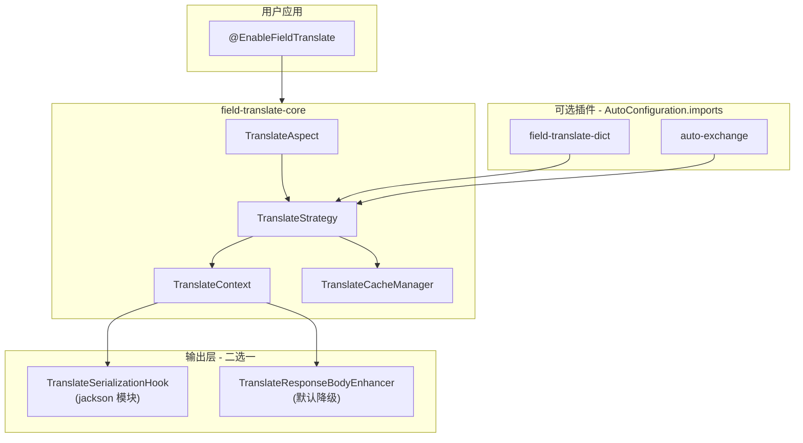

# field-translate 拆分与 auto-exchange 插件化设计

**日期:** 2026-07-12  
**状态:** 已批准  
**作者:** juwencheng

## 背景与目标

`auto-exchange` 已演进为通用字段翻译框架 + 汇率业务插件。现需：

1. 将 **translate 核心** 剥离为独立 Git 仓库 **`field-translate`**
2. **`auto-exchange`** 瘦身为汇率插件，依赖 `field-translate`
3. 允许 breaking change，以最佳架构为导向（用户量尚小）
4. 新基线：**Spring Boot 3.x + Java 17**
5. 输出层与 Jackson 解耦，提供可替换 SPI
6. README 中提供完整使用说明

## 决策摘要

| 项 | 决策 |
|----|------|
| 仓库形态 | 独立 Git 仓库 `juwencheng/field-translate` |
| 兼容策略 | Breaking change，删除旧双轨（`@AutoExchangeField`、`AutoExchangeContext` 等） |
| 项目命名 | `field-translate`，坐标 `io.github.juwencheng:field-translate-*` |
| 包名 | `io.github.juwencheng.fieldtranslate.*` |
| 字典翻译 | 可选插件模块 `field-translate-dict`（不进 core） |
| 核心启用 | `@EnableFieldTranslate`（显式开启，有全局副作用） |
| 插件加载 | classpath + `META-INF/spring/org.springframework.boot.autoconfigure.AutoConfiguration.imports` |
| Spring 版本 | Boot 3.3+，Java 17+ |
| Jackson | 独立可选模块 `field-translate-spring-boot-jackson`，starter 默认引入 |
| 非 Jackson | `TranslateResponseBodyEnhancer` + `AppendedFieldsMerger` 降级路径 |

---

## 仓库与模块结构

### 新仓 `field-translate`

```
field-translate/                              (parent pom)
├── field-translate-spring-boot-core          # SPI、Context、Aspect、Strategy、Cache（无 Jackson）
├── field-translate-spring-boot-autoconfigure # @EnableFieldTranslate、核心 Bean、ResponseBodyAdvice
├── field-translate-spring-boot-jackson       # TranslateSerializationHook 的 Jackson 实现（可选）
├── field-translate-dict                      # 字典插件：DictFieldTranslator、IDictDataProvider
├── field-translate-spring-boot-openapi       # springdoc 2.x，增强 @Translate* 文档（可选）
├── field-translate-spring-boot-starter       # core + autoconfigure + jackson（jackson 可 exclusion）
└── field-translate-spring-boot-test-app      # 演示 core + dict + openapi
```

### 现仓 `auto-exchange`（瘦身后）

```
auto-exchange/
├── auto-exchange-spring-boot-core            # 仅汇率：ExchangeManager、ExchangeFieldTranslator、调度
├── auto-exchange-spring-boot-processor       # 可删除或改为校验 @TranslateField(exchange) 相关
├── auto-exchange-spring-boot-autoconfigure   # ExchangeAutoConfiguration（AutoConfiguration.imports）
├── auto-exchange-spring-boot-starter         # 依赖 field-translate-starter + exchange 插件
├── auto-exchange-spring-boot-openapi         # 扩展汇率字段文档（可选）
└── auto-exchange-spring-boot-test-app        # 演示汇率 + 可选 dict
```

**依赖关系：**

```text
auto-exchange-starter
  └── field-translate-starter
  └── auto-exchange-core + autoconfigure
  （不默认传递 field-translate-dict）

field-translate-starter
  └── field-translate-core + autoconfigure + jackson
```

---

## 启用与自动装配

### 核心（显式）

```java
@SpringBootApplication
@EnableFieldTranslate
public class App { }
```

`@EnableFieldTranslate` → `@Import(FieldTranslateAutoConfiguration.class)`，注册：

- `TranslateStrategy`、`TranslateAspect`、`TranslateInterceptor`
- `TranslateContext` / `TranslateContextHolder`
- `TranslateCacheManager`、`TranslateCacheStrategyRegistry`（无硬编码 translator）
- 默认 `TranslateResponseBodyEnhancer`（当无 Jackson hook 或 `output.mode=response-body-advice`）

### 插件（自动发现）

各插件 jar 提供：

`META-INF/spring/org.springframework.boot.autoconfigure.AutoConfiguration.imports`

```text
io.github.juwencheng.fieldtranslate.dict.autoconfigure.DictAutoConfiguration
io.github.juwencheng.fieldtranslate.jackson.autoconfigure.JacksonTranslateAutoConfiguration
io.github.juwencheng.autoexchange.autoconfigure.ExchangeAutoConfiguration
```

插件配置类示例：

```java
@AutoConfigureAfter(FieldTranslateAutoConfiguration.class)
@ConditionalOnBean(TranslateStrategy.class)
@ConditionalOnProperty(prefix = "field.translate.dict", name = "enabled", matchIfMissing = true)
public class DictAutoConfiguration { ... }
```

### 关闭插件

- 不引依赖，或
- `field.translate.dict.enabled=false` / `auto.exchange.enabled=false`

`@EnableDictTranslate`、`@EnableAutoExchange` **不作为必需注解**；后者可选保留为语法糖别名。

---

## 配置前缀

| 前缀 | 模块 | 内容 |
|------|------|------|
| `field.translate.*` | 核心 | `enabled`、`aspect-order`、`translate-cache.*`、`output.mode`、`output.preferred` |
| `field.translate.dict.*` | dict 插件 | `enabled`、`cache-ttl` 等 |
| `auto.exchange.*` | exchange 插件 | 默认币种、缺失策略、定时刷新等 |

---

## 插件注册约定

1. **FieldTranslator** — 实现接口并注册为 `@Bean` / `@Component`
2. **TranslateContextContributor** — 向请求 Context 写入属性（如目标币种）
3. **TranslateCacheStrategy** — 通过 `TranslatorCacheBinding` Bean 绑定到具体 translator（registry 不硬编码类名）
4. **TranslateSerializationHook** — 框架原生序列化扩展（Jackson/Gson 等）
5. **TranslateResponseBodyEnhancer** — MVC 层通用增强（降级）

---

## 输出层 SPI

### 核心数据契约（`TranslateContext`）

```java
// AOP 阶段写入
void addAppendedData(Object targetObject, String fieldName, Object data);

// 输出阶段读取（identity-based，支持嵌套）
Map<String, Object> getAppendedDataFor(Object targetObject);
```

### 层 1：框架原生钩子（推荐，嵌套 Append 最完整）

```java
public interface TranslateSerializationHook {
    String getId();                          // "jackson", "gson", ...
    boolean isAvailable();
    void register(SerializationHookContext context);
}
```

- `field-translate-jackson` 模块提供默认 Jackson 实现（`BeanSerializerModifier`）
- 第三方可为 Gson/Fastjson2 实现同接口并发布独立 jar

### 层 2：Spring MVC 通用增强（不绑 Jackson）

```java
public interface TranslateResponseBodyEnhancer {
    boolean supports(ResponseEnhancerContext context);
    Object enhance(Object body, TranslateContext context);
}

public interface AppendedFieldsMerger {
    Object merge(Object root, TranslateContext context);  // 反射合并为 Map 树
}
```

通过 `ResponseBodyAdvice` 调用，适用于任意 JSON `HttpMessageConverter`。

### 输出模式与优先级

```yaml
field:
  translate:
    output:
      mode: jackson-hook              # 默认；可选 response-body-advice
      preferred: jackson,gson         # 多 Hook 时的选择顺序
```

同一请求仅激活一种输出路径；用户自定义 Bean 可通过 `@Order` / `@ConditionalOnMissingBean` 覆盖。

---

## 删除与迁移（breaking）

### 从 `auto-exchange` 删除

| 删除项 | 替代 |
|--------|------|
| `@AutoExchangeField` / `@AutoExchangeResponse` | `@TranslateField(translator=ExchangeFieldTranslator.class)` + `@TranslateResponse` |
| `@AutoExchangeBaseCurrency` | `@TranslateField` + exchange 插件约定 |
| `AutoExchangeContext` / `AutoExchangeInterceptor` | 统一 `TranslateContext` + `ExchangeContextContributor` |
| `AutoApplyExchangeStrategy` 及旧 strategy 包 | `ExchangeFieldTranslator` |
| `AutoExchangeAspect` | `@TranslateResponse` + `TranslateAspect` |
| `TranslateAppendingBeanSerializer` 中 AutoExchangeContext 分支 | 仅 `TranslateContext` |
| `AutoExchangeProperties` 中的 translate-cache | `field.translate.*` |
| `TranslateCacheStrategyRegistry` 硬编码 | `TranslatorCacheBinding` 注册 |
| 旧 deprecated serializer 包 | 移除 |

### 注解与用法对照

```java
// 旧
@GetMapping("/order")
@AutoExchangeResponse
public OrderWithDict getOrder() { ... }

// 新
@GetMapping("/order")
@TranslateResponse
public OrderWithDict getOrder() { ... }

// 字段：旧 @AutoExchangeField → 新
@TranslateField(value = "amountInCny", translator = ExchangeFieldTranslator.class)
private BigDecimal amount;

// 字典
@TranslateField(value = "statusText", translator = DictFieldTranslator.class, args = {"order_status"})
private Integer status;
```

---

## 迁移阶段与发布顺序

### Phase 1：创建 `field-translate` 仓库

1. `gh repo create field-translate --public --description "Spring Boot 字段翻译框架"`
2. 搭建 parent + core + autoconfigure + jackson + starter + test-app
3. 从 `auto-exchange-spring-boot-core` 迁移 `core.translate` 通用代码（去 exchange 耦合）
4. 实现 SPI：`TranslateSerializationHook`、`TranslateResponseBodyEnhancer`、`AppendedFieldsMerger`
5. 补 `AutoConfiguration.imports`、`@EnableFieldTranslate`
6. 发布 `field-translate` **1.0.0-SNAPSHOT** 到本地 / OSSRH
7. **README**：依赖组合、Enable、插件自动发现、Jackson exclusion、SPI 扩展、配置项

### Phase 2：`field-translate-dict` 与 openapi

1. 迁移 `DictFieldTranslator`、`IDictDataProvider`、字典缓存
2. `DictAutoConfiguration` + imports
3. openapi 模块（springdoc 2.x）
4. test-app 覆盖 dict + jackson + advice 降级场景

### Phase 3：瘦身 `auto-exchange`

1. 升级 Boot 3 + Java 17
2. 依赖 `field-translate-starter`
3. 保留并迁移 `ExchangeFieldTranslator`、`ExchangeManager`、调度、Contributor、Exchange 缓存绑定
4. 删除旧双轨代码
5. 更新 test-app、README、迁移指南
6. 发布 `auto-exchange` **1.0.0**（major bump）

### Phase 4：文档与示例

1. `field-translate` README：完整使用手册（见下节结构）
2. `auto-exchange` README：定位为 exchange 插件 + 迁移说明
3. 两仓 CHANGELOG

---

## README 内容结构（field-translate）

1. **简介** — 框架定位、Append 模式说明
2. **快速开始** — starter + `@EnableFieldTranslate`
3. **依赖组合表**
   - 仅核心 / +dict / +openapi / +auto-exchange
4. **注解参考** — `@TranslateResponse`、`@TranslateField`
5. **插件开发** — `FieldTranslator`、`TranslateContextContributor`、缓存绑定
6. **插件自动发现** — 无需 `@EnableDictTranslate`
7. **Jackson 与输出模式**
   - 默认 jackson-hook
   - exclusion jackson 模块
   - `output.mode=response-body-advice`
8. **替换序列化框架**
   - 实现 `TranslateSerializationHook` 示例（Gson 骨架）
   - 自定义 `TranslateResponseBodyEnhancer`
   - `TranslateContext` API 说明
9. **配置参考** — `field.translate.*`
10. **与 auto-exchange 集成** — 链接到 exchange 仓库

---

## 架构图



---

## 风险与缓解

| 风险 | 缓解 |
|------|------|
| 两仓版本协调 | exchange 明确依赖 field-translate 版本范围；CI 集成测试 |
| Append 嵌套在 advice 模式下的差异 | README 对比表；test-app 覆盖嵌套 DTO |
| Boot 3 迁移工作量 | 新仓直接 3.x；exchange 一次性升级 |
| 旧用户迁移 | migration 章节 + 注解对照表 |

---

## 非目标（v1）

- Spring Boot 2.7 双版本支持
- Gson/Fastjson2 官方插件（仅 SPI + 文档示例）
- `@AutoExchangeField` 兼容层
- 非 JSON 协议（Protobuf/XML）的内置支持
